# Looper Cube Documentation

## Intro/Motivation

1. I wanted to create an instrument with built-in functionality for looping. This would allow me to have a homophonic instrument with polyphonic capability. By adding individual layers one at a time, you can get a more complicated texture of a piece.
2. I wanted to create an instrument that took advantage of 3D space. My original idea was to integrate velocity to get position, allowing you to play different notes based on the physical position of the instrument, but that was unfeasible. So, I used rotation (like a Rubik's cube) to achieve various musical effects.
3. I wanted to create an instrument where a single input control could determine different musical parameters and outputs. The final result was a ribbon softpot that could play various pitched and percussive sounds, as well as possible different scale and arpeggiated configurations.

## Specs

The physical/electrical components of my project consist of a Teensy 4.1 (with more memory to allow for multiple delay lines), MPU6050 IMU (to control looping and musical parameters), ribbon softpot (to control pitch/percussion), OLED (to display a menu with different settings), and encoder (to toggle through different options in the menu).

The IMU and OLED are connected to the Teensy 4.1 via I2C, the encoder through two digital pins (with interrupt capability), and the softpot through two analog pins. For the ribbon softpot, the middle pin is connected to VCC, and the two pins on the sides are connected to both a 10k resistor (which is connected to ground) and an analog pin. The two values are averaged, as discussed later in the documentation (in Week 2).

Week 1 circuit

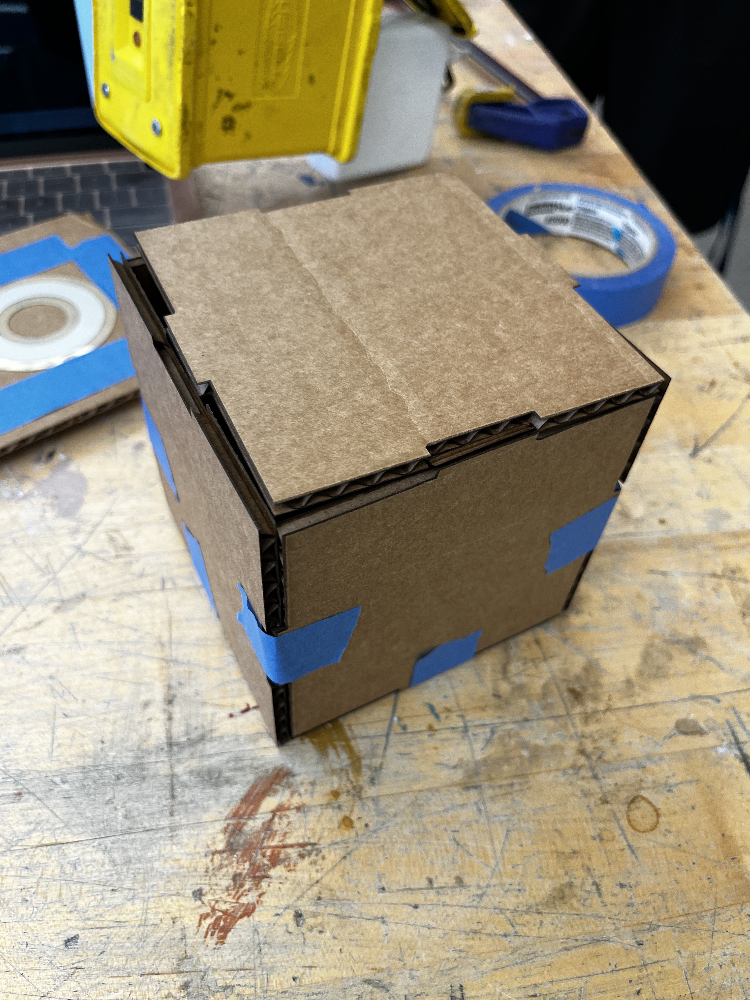
Week 2 box

Prototyping ribbon softpot

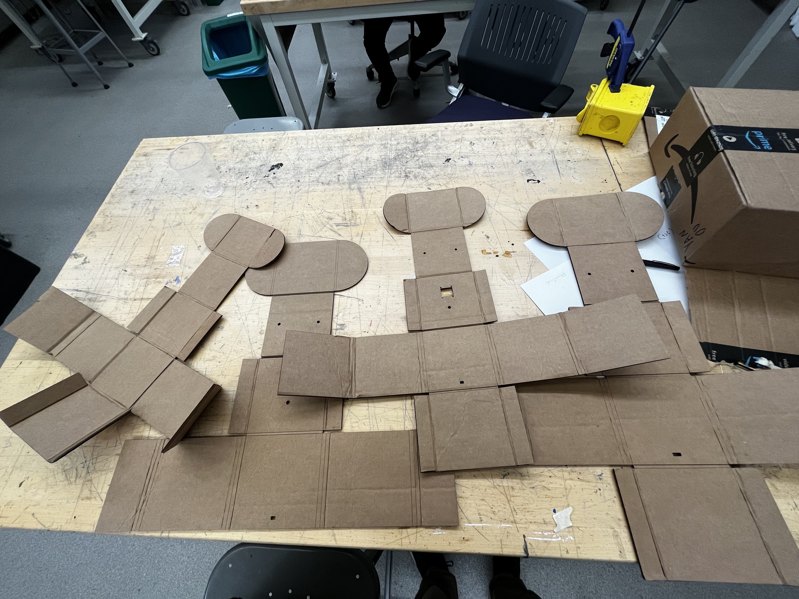
Various Week 3 box prototypes

More images of the iterations of box prototypes are shown in Week 3 and 4 of this documentation.

## Design Challenge

I had issues with the ribbon softpot. This is described in detail in Week 2 Issues under Week 2 in this documentation.

## Instrument Features

- Sound modes: square wave, sawtooth wave, chiptune mode, chord mode, percussion mode. Change via the menu.
- Octave: In playing position (the ribbon softpot facing up), rotate the cube left and right to lower and raise the octave. You will hear a soft ping (different for left and right) indicating you successfully changed the octave.
- Metronome: Turn on a metronome and adjust its speed via the menu.
- Looping functionality: Turn on looping functionality via the menu. Turn the cube into playing position (the ribbon softpot facing up) by turning the cube away from you to start the current layer. It will continue recording any new sounds into the current layer indefinitely. To discard the current layer, turn the cube away from you. You will hear a soft ping to indicate that the current layer was successfully cleared. To return to recording new sounds into the current layer, just turn the cube toward you to return to playing position. To save the current layer into the permanent loop, turn the cube toward you to return to home position (OLED screen facing up). After 2.4 seconds, the current layer will be saved into the permanent loop, and you can return to playing position to record a new layer. To switch to a different loop (there are 4 total loops), go to home position and rotate the cube left and right. You can clear an entire permanent loop via the menu option.

## Github Link

<https://github.com/Firebird1029/enas344-final>

## Onshape Link

<https://cad.onshape.com/documents/c56e6d95d16b1adce310dbf6/w/8d8bbd945732a7b373984392/e/5b0628c9e16f663cd0e7146c?renderMode=0&uiState=645af569eba35b5de2bdc130>

## Weekly Progress Reports

### Week 1

#### Notes

For my very first step, I got the encoder sensor working. The encoder allowed me to set the continuous pitch of a note. I also got the IMU sensor working (by referring back to a previous Lab).

#### Week 1 Issues

- I later discovered that the large encoder runs on 5V not 3.3V, so once I switched to powering my circuit on 3.3V, the large encoder no longer worked.
- The IMU kept hanging (I would have to restart the Teensy each time it randomly hung up), but I later discovered this was due to powering it via 5V instead of 3.3V.
- The motion sensor drifted a lot, but I fixed that by working with Professor Wilen to calibrate the zero position of the IMU.

#### Resources

- basic_readings_calib: calibrates IMU
- basic_readings_fusion_v4: returns pitch and roll values of IMU
- <https://lastminuteengineers.com/rotary-encoder-arduino-tutorial/>
- <https://www.pjrc.com/teensy/td_libs_Encoder.html>

### Week 2

#### Combining IMU + Audio -- Version 1.0

During the first half of the week, I focused on combining the motion sensor code with Teensy audio code. Previously, I had these different parts of functionality working individually, but putting them together presented its own challenge. After integrating the two different pieces of code, I was able to create **v1.0** of the code, which uses an encoder to determine pitch (continuous pitch) and 3D motion (from the MPU6050) to determine the audio ladder function frequency cutoff (corner frequency) and oscillation depth (frequency control).

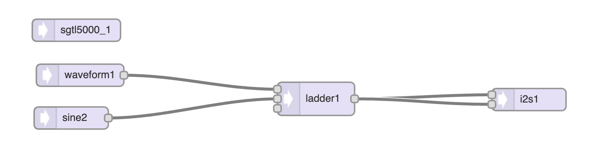

I also cut out a simple cardboard box, as well as laser-cut another simple cardboard box, to hold the electronics.

#### Ribbon Softpot -- Version 1.1, 1.1.1

I connected a ribbon softpot (a circular softpot, [Adafruit](https://www.adafruit.com/product/1069)) to my setup, allowing me to replace the encoder to control pitch. The reason behind this was to allow me to control the on/off state of a note, so that pressing the softpot would cause the envelope to turn on and releasing my finger would cause the envelope to turn off. While getting the softpot hooked up to the Teensy was relatively straightforward, I ran into several different issues, discussed later. The softpot's resistance is 9.39 kilo Ohms.
In the "To use" section of the Adafruit page for the softpot, it specifies to use 10k resistors. I believe that using these resistors made it easier to know when the softpot was being pressed at all or not (in the original, non-modified setup), as the analog reading would range from 1/3 to 2/3 of 0-1023, instead of the full range of 0-1023. Therefore, any reading below 341 or above 682 would mean the softpot was not being pressed. However, I would later change the softpot circuit setup anyway to fix some issues I was having.

In Version 1.1.1, I added an envelope in the Teensy audio configuration to create a more exciting sound when one presses the softpot.

#### Week 2 Issues

During the second half of the week (and into the first half of Week 3), I ran into multiple hardware/electronics-related roadblocks. One minor issue was that my encoder wiring kept breaking off from the headers, but Larry was able to put heat shrink on the wires to prevent it from happening. Most of my issues concerned the softpot. Here is a list.

1. I was running the softpot at 5V (because the encoder needed to be run at 5V), which offset all the softpot readings (it was putting ~600-1023 instead of ~341-682). Changing the circuit to use Teensy's 3.3V instead of 5V fixed this.
2. The softpot became extremely inconsistent and inaccurate. Pressing the same spot on the softpot would generate random notes from values that spanned the entire softpot's range. It turned out this was because the middle pin was "floating," and so previous softpot values were affecting later softpot readings. Larry helped me switch to a new softpot circuit so that two out of three of the pins were connected to ground via 10k resistors, and the middle pin was connected to 3.3V. Then, two analog connections to the Teensy were connected to the two ground pins, which allowed me to read the resistance value of the softpot from both ends of the softpot. This way, when the softpot wasn't pressed, the value was always zero. Not only did this fix the consistency issue (so that pressing the softpot at the same spot would generate the same note), but it allowed me to normalize and compensate for finger width. I could get the "average" or "middle" point of the two different analog readings to determine more precisely where the softpot was being pressed.
3. There was a ramping issue where pressing your finger down would send values that "ramped" up to the actual resistance value at that point, and releasing your finger would send values that "ramped" back down to zero. Because these ramp-up and ramp-down values mapped to actual lower notes when the final value was a higher note in the register, it produced extra tones before finally reaching the "stable" note value. Adding a short delay (2-10 ms) to the main loop fixed some of the ramping. To fix the ramp-up issue, it was straightforward to detect a softpot value, then do the actual reading a few milliseconds after for the stable value. The ramp-down issue proved much harder (picture below), because you couldn't tell if the ramp-down bug was happening or if the performer was simply going down the softpot to an actual lower note intentionally.
4. To fix the ramp-down bug, Konrad helped write a new `map` function because the last one seemed to consistently produce the issue. The new softpot circuit also helped. After these fixes, there was still a slight issue with an extra tone being heard when the performer's finger was released, but it was only the neighboring semi-tone and not lower notes, and it happened much less. Adding a `delay(10)` got rid of it for the most part.

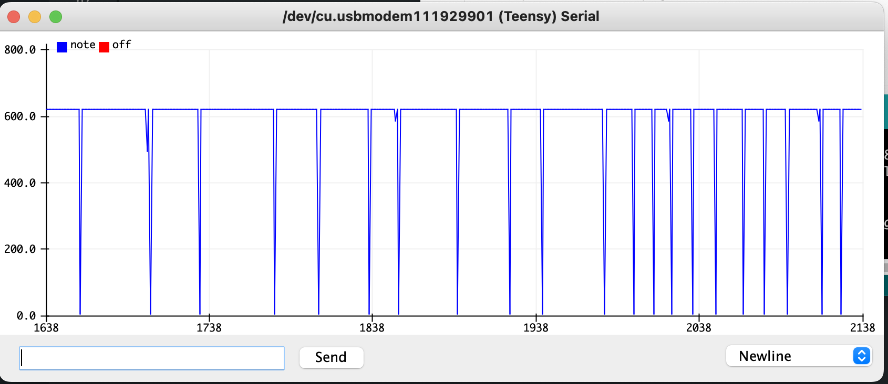

#### Delay Lines -- Version 2.0

While working on softpot issues, I also worked on getting a delay line working. Konrad gave me an initial demo sketch of a Teensy delay line, and I was able to learn, from the sketch, how a delay line works in Teensy. This initial version of a delay line relied on two buttons. One button started the two-second loop recording, and the other button played a random note. He also gave me an updated delay line C++ library so that I could create a loop longer than a few seconds.

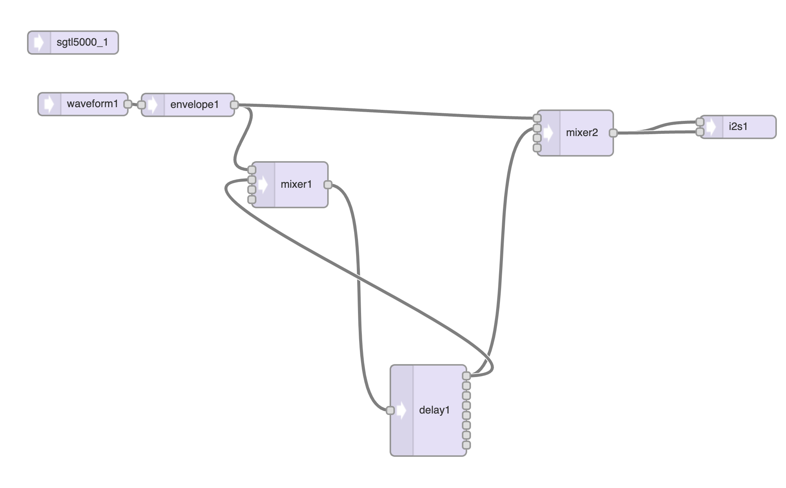

After playing around with the delay line demo sketch, I worked on `v2.0` of my code, which combined the sensors with the delay line. The next step was to create a second delay line. The first delay line was the "temporary" one, which allowed you to record new sounds. The second delay line was the "full" one, which stored all previous saved temporary loops. For example, the performer could record a loop, then decide whether to keep it (and "commit" it into the full delay line) or discard it.

The confusing part of this code was that there were actually three loops happening at the same time. The first loop is the standard Arduino `loop()`, which takes a variable amount of time each iteration. Code (including if statements) are running at this rate, and so there is some innate level of latency built-in when "waiting" to listen for the button press that starts the loop recording. The second loop are the Teensy delay lines, operating at a periodicity defined by `delayObject.delay(0, LOOP_TIME);`. Finally, the third loop starts based on client interaction (e.g. button press), goes through one iteration, then stops. For example, when the client presses a button, the third loop starts at 0 and goes to `LOOP_TIME`, but the second loop (Teensy delay lines) might be halfway through its iteration. This means that `LOOP_TIME` milliseconds are recorded (when the third loop goes from 0 to `LOOP_TIME`), although the second loop, i.e. the delay lines, are actually wrapping around, and therefore are not actually ending at `LOOP_TIME` after `LOOP_TIME` seconds.

I ran into two main issues while integrating the delay lines into my existing v1 code. The first was just the complexity of the Teensy audio configuration.

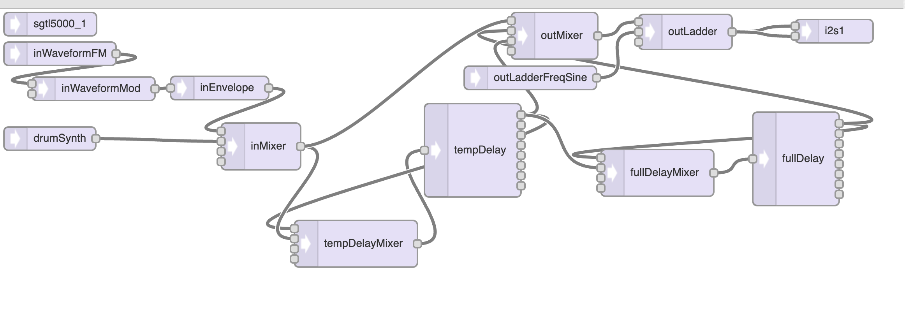

It took some time figuring out the right way to connect the various outputs to various inputs, especially regarding the delay line feedback and output into the final mixer. It took a few tries to get it right. In the code, I had to make sure I was toggling the right mixer channels at the right stages of the loop recording process, to avoid creating duplicate, infinite, or nonexistent recordings. The other issue was debugging why the delay line was not working at first. It turns out that the order of `delayLine.begin()` and `delayLine.delay()` mattered; I originally had them swapped. I also had to do a `delayLine.clear()` as well and only set the delay line's signal into the final mixer to a gain of 1.0 after the first loop recording. This was to avoid random noise that would always be played before the first loop recording.

#### Week 2 Resources

- apr12_ribbon_octave: Reads the value from the ribbon softpot and prints it out to the Serial monitor. Uses the old softpot circuit and mapping functionality.
- delay_looper_demo: Konrad's delay line looping code.
- ribbon_read: Reads the value from the ribbon softpot and prints it out to the Serial monitor. Uses the new softpot circuit and mapping functionality.
- I used a free online tool to help me generate the .svg for laser-cutting a box: <https://en.makercase.com/#/>. Specifically, I used <https://en.makercase.com/#/basicbox>.

### Week 3

#### Prototyping Cube

For the most part of the third week, I switched over from coding to work on the physical box. I used the laser-cutter and cardboard to design fancy nets of cubes that would fold into itself to hold in place. That way, I could prototype quickly without needing to use glue. At the end of the week, I was able to have a simple but working cardboard cube that was my "instrument." I went through ~7 prototypes of cardboard, and each net took up a full sheet of cardboard.

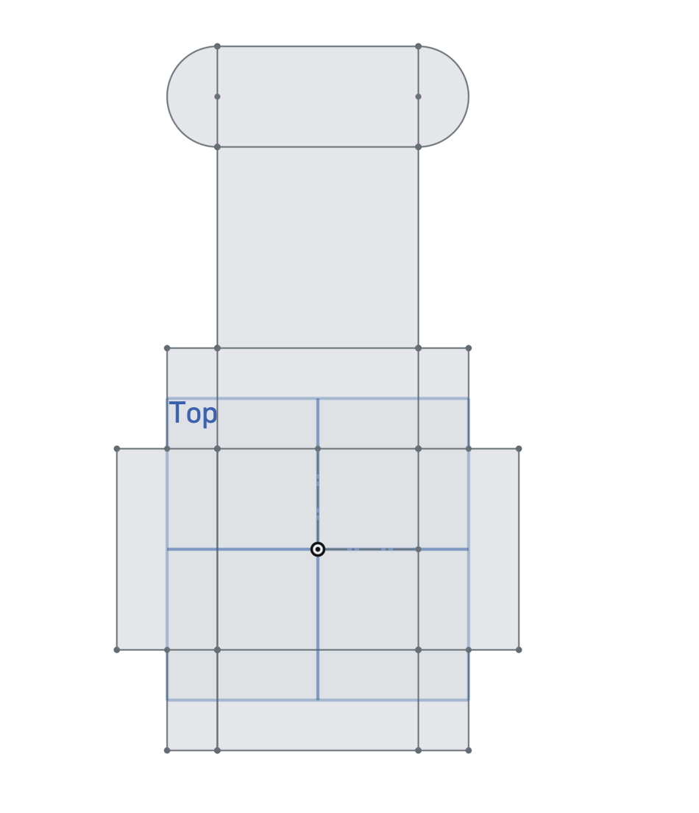
Prototype 1

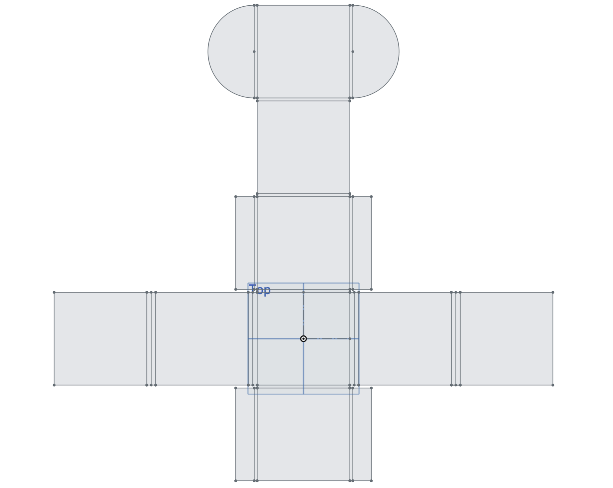
Prototype 2

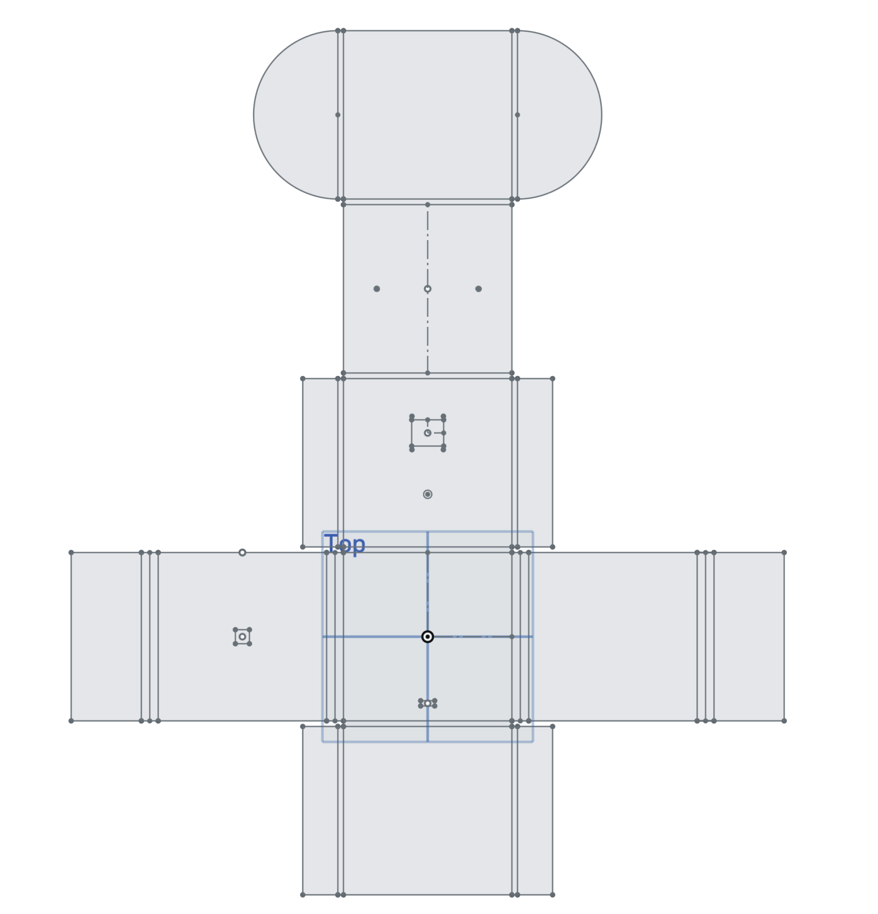
Prototype 5 (Final Prototype)

#### IMU-Controlled Inputs -- Version 2.1

After creating the two delay lines and getting them to work, I needed a way to save and discard temporary loop recordings without using buttons. The solution was to use the IMU to detect when the instrument is tilted toward you (to save the recording) or tilted away from you (to discard the recording). This way, you can add layers to the instrument's musical texture of the loop, one by one, while also being able to "undo" the last loop recording if necessary. Along with using the *roll* to control saving/discarding layers of the loop, I used the *pitch* to allow the performer to add vibrato. This vibrato is added while a note is being played (via the softpot) and not added after-the-fact. You can also shake/jolt the instrument vertically (one shake/jolt) to play a percussive sound. This made it possible to shake the instrument while playing on the softpot, to generate tonal and percussive elements at the same time.

#### Menu Screen -- Version 2.2

This was the version of the code that brought together all the different hardware components of my project once and for all. I added an encoder and OLED screen. This allowed me to toggle between different sound modes (chord mode, chiptune mode, etc.), as well as adjust the volume, and clear the full loop. I spent some time working on figuring out how to toggle a visible cursor through a menu by using the encoder value, and how to make a menu item "active," which allowed me to toggle through various options in one particular menu item. This required a bit of coding logic, but it was a fun challenge to implement.

#### Chord Mode, Chiptune Mode -- Version 2.3

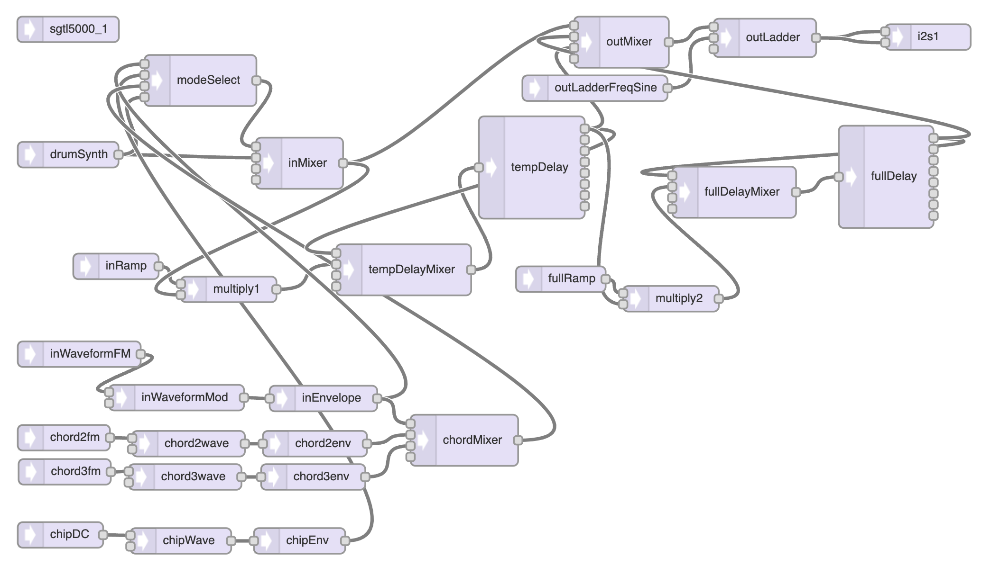

I added a Chord mode and a Chiptune mode. The Chord mode plays a 3rd above the fundamental oscillator and a 5th above. This mode is good for drones. The Chiptune mode is my favorite, and plays a video game-esque sound by quickly iterating through an arpeggio. By changing the fundamental of the arpeggio, it changes the overall pitch of a "single" note. I played around with different arpeggio sequences and rates, but stuck with one since there was no easy way to toggle between different sequences (as of yet).
I also modified some lines in the IMU code so that the gyro would be zeroed at its new location in the cube, since originally it was zeroed when facing the side instead of straight up.
On the music side, I switched from a chromatic scale to a diatonic scale, since that made more sense for the Chord mode. Also, mapping the softpot to seven discrete regions was a lot easier to play than twelve discrete regions. In the code, I fixed a bunch of looping-related bugs. First, I fixed a bug where the temporary delay line was playing through one extra iteration while the full delay line was being outputted as well. This resulted in a loud, sharp sound for one iteration of the loop, when both delay lines were on and outputting sound but the first delay line hadn't been cleared yet. The solution was to stop routing the temporary delay line into the output mixer before routing its output to the input of the full delay line. This fixed the "double timbre" glitch where the sound became extra strong for one iteration at the beginning of the commit stage of the looping process. The second thing I fixed was a popping or clicking sound at the edge of the delay line. This is because at the very instant the delay line starts, the input might be nonzero, and so the next time the delay line replays that sound, it has to jump to that new value which causes a pop/click sound. This was most prevalent when playing a drone note, because the drone lasted for the full duration of the delay line. I fixed this by adding a ramp, which is a DC object feeding into a multiply object. I start the DC object with an amplitude of 0.0, then over 50 milliseconds (arbitrary), I increase it to 1.0. This way, the input sound starts from zero then ramps up to its actual value over a short period of time, preventing the pop/click. The shorter the ramp, the less audible the ramping effect is, but the more audible a possible pop/click becomes.

#### Week 3 Issues

- I needed to design a cube that was large enough to hold the electronic components inside (especially the Teensy, since I was using the Teensy 4.1 for the delay lines), but not too big to become unwieldy and heavy to hold. My first prototype was way too small, but over the seven or so different iterations, I was able to get to a size that was both big enough for the Teensy and also small enough to be holdable.
- The encoder I was using had a bad connection at one of its leads, which took me a while to debug. At first, I couldn't tell if it was an issue with my code or the Teensy, but it turned out to be the encoder. After getting that connection re-soldered, the encoder was fixed.
- After re-normalizing the IMU to its new default orientation in the box, there was an error in the equations where changing the pitch of the box would also change the roll value. This made it impossible to add functionality based on the roll of the box in multiple different pitch orientations. Fortunately, Jiacheng looked at my code and was able to change the trigonometric formulas so that the pitch and roll values were separate.

#### Week 3 Resources

- basic_readings_fusion_v2: Code to return pitch and roll values from the IMU at a normalized position when the IMU is flat instead of on its side.
- konrad_chiptune: Konrad's chiptune arpeggiation code.
- oled_tests: Working menu code, before integrated into the rest of the code.

### Week 4

#### Acrylic Cube

The final week of the project was a mad rush to finish all the various aspects of my instrument, especially the physical aspects of my box. I finished soldering all the electronic components together, which took some time but not super long. Then, I put all the electronic components together into the cardboard box. Once I had a finished physical instrument that I could play, I worked on improving the aesthetic of the box by switching over to wood and black acrylic. First, I cut two squares of wood for the sides of the box, and I had to calculate out the dimensions of the other four squares of acrylic, because I had to account for the thickness of the acrylic to ensure a perfect cube. I was able to get it in one shot because I already had all the dimensions from the cardboard version. There were some minor adjustments I had to make (e.g. the encoder hole was slightly too small), but getting all the electronics mounted into the new acrylic version was pretty quick.

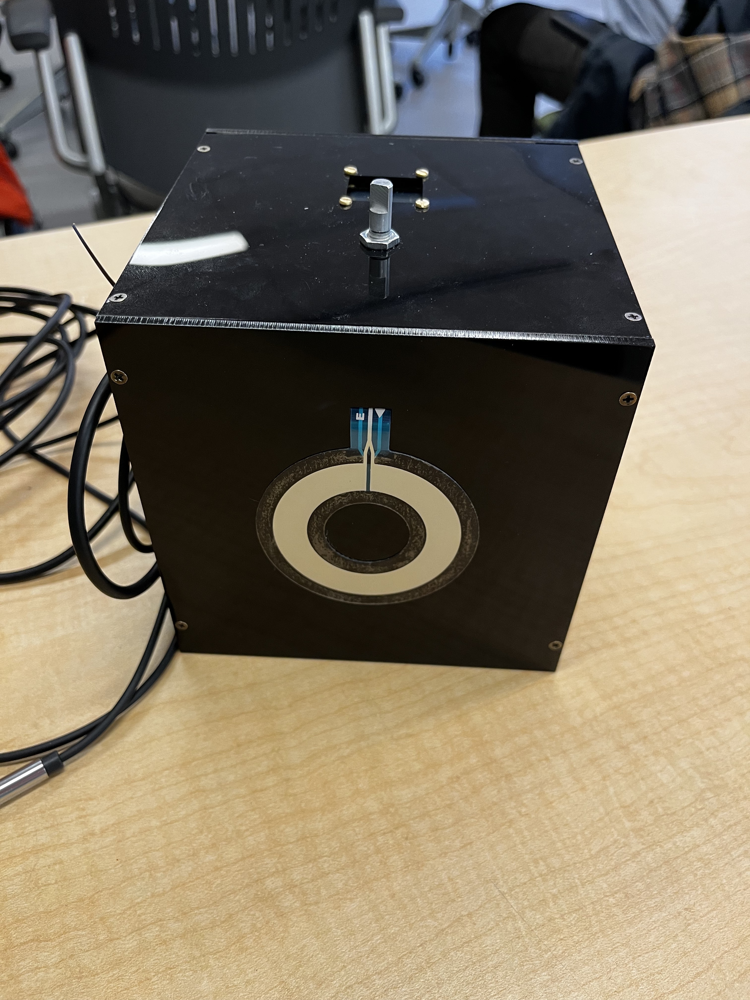

#### Final Code Updates -- Version 2.4, 2.5

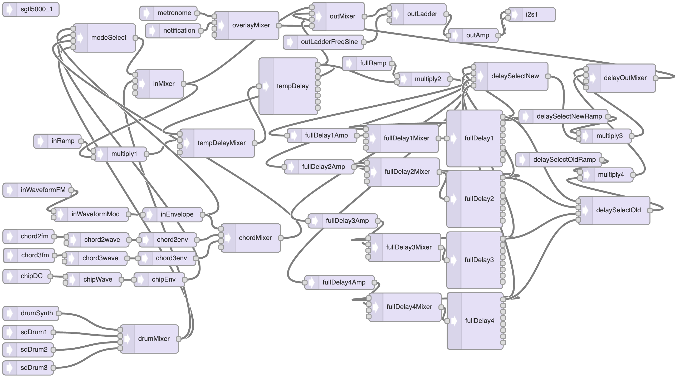

I didn't keep as good documentation during this final week, because most of my time was spent prioritizing finishing my instrument. Some list of features I added during this week besides finishing up the box and practicing the instrument:

- I finalized and polished the looping code. It was relatively buggy previously, with random pops and clicks, and was clunky to use because you had to wait for one iteration of the loop at a time before moving on to the next stage of the looping process. With some adjustments, I made it so you can end a new loop recording at any stage, both before and after one full duration of the loop, and add multiple layers at once without having to commit one layer first.
- I added a Percussion mode. Konrad provided percussion samples. I played around with trying to get multiple audio SD objects working at the same time, but couldn't get it working, so you can only play one percussive sound at at time for now.
- I added a metronome, so that you can hear when the loop starts and ends. The metronome is overlayed on top the actual loops, so the metronome sound doesn't get stored into the loops. This made it a lot easier to play, since I wouldn't have to figure out the duration of the loop manually each time I played my instrument by playing one note then waiting until I heard it again.
- I added the ability to change the octave by rotating the cube left and right. Originally, this control was for adding vibrato, but I figured adding more registers to the instrument was more important at first. Vibrato can be added back by using pitch instead of roll, allowing you to have both octave control and vibrato.
- A minor addition was adding a visual indication on the OLED for when the looping process was in the committing stage, because that made it possible to know when it was ok to start adding a new layer to the loop once the committing stage was finished.
- In v2.5, I added three additional delay lines to get a total of four delay lines. In effect, I could record into four "measures" of four beats each (at 100 BPM). You can toggle through the different loops/measures by rotating the cube left and right when in the "Home"/Menu orientation.
- I added a "ping" sound effect as feedback for various actions. For example, there is a sound that swoops down plays when you lower the octave, and vice versa. There is another sound when you discard the temporary loop as well.
- I added the ability to toggle the looping functionality on/off. This made it possible to test and play sound modes without having to worry about it repeating.

## Future Steps

- The next step would be to find a better way to strain-relieve the wires coming out of the box besides zip tying them to the side of the box. Moving the wire management inside the box or switching to a wireless version would be ideal.
- Allowing the performer to adjust the volume of individual layers would be helpful, so that you could design a more intricate texture of music instead of having each layer being a static amplitude.
- Another IMU-based control is shaking the box. I originally had it so that one shake would produce a percussive sound, but it was buggy in real life, because a hard tap on the box or rotating the box too quickly would cause the acceleration value to trigger the threshold. By doing some temporal rounding or algorithm, it might be possible to perform a certain musical action when shaking the box up and/or down, without having it get triggered by random movement.
- It would be nice to quantize the note inputs to time so that it would sound better, although that would cause one to play and interact with the instrument very differently than how it is currently.
- Some basic additions to the instrument would be the option to change the scale type (major, minor, pentatonic, chromatic, etc.) and set the tonic note. I didn't get to these additions, partly because I ran out of space on the OLED screen. Any new additions would require the screen to "scroll" through many different options. Adding push buttons might also make controlling the modes and options easier.
- Another addition could be allowing the user to change the tempo of the loop, although that gets complicated because the loop's time is hard-coded as a constant, and so changing the tempo would require a unique solution to reusing delay lines that are still operating at a fixed duration regardless of tempo. Currently, the delay lines are just set to be the temporal length of one measure operating at a tempo of 100 BPM.

## Conclusion

Overall, I had a lot of fun making my cube instrument and definitely learned a lot. I am excited to see what else I can make in the CEID in my remaining years at Yale with the new experience I gained in design, engineering, coding, and music!

## Appendix

### Code Versions

1. v1.0 -- Encoder, IMU -- Basic code that plays pitch (based on encoder reading) and filters it through a ladder filter (adjustable based on IMU reading).
2. v1.1 -- Ribbon pot -- Added ribbon softpot, which sets the pitch (chromatic through one octave) when touched.
   1. v1.1.1 -- Ribbon pot -- Added envelope to allow note on/off when softpot is pressed and released. Does not work (see Issues).
   2. v1.1.2_broken -- Ribbon pot -- Updated pinout to Teensy 4.1, commented out IMU code, updated `getRibbonPotValAndMap` to use new softpot circuitry, added delay for ramp up bug. Does not work (see Week 2 Issues).
   3. v1.1.3_broken -- Ribbon pot -- Tried to store stable values of pitch to combat ramp down bug. Does not work (see Week 2 Issues).
3. v1.2 -- Ribbon pot -- Working code (doesn't use faulty map function, manually maps from two analog values). Uses ribbon_read formulas.
4. v2.0 -- Ribbon pot, buttons -- With two delay lines.
   1. v2.1 -- Ribbon pot, buttons, IMU -- With IMU motion connected (roll, pitch, shake) to musical parameters.
   2. v2.2 -- Ribbon pot, buttons, IMU, Enc, OLED -- Added working menu navigation using the OLED and encoder.
   3. v2.3 -- Full hardware (same as above). -- Added chiptune and chord modes. Added ramps to delay input gates. Switched to diatonic scale.
   4. v2.4 -- Full hardware. -- Finalized and polished looping code. Added percussion mode and metronome. Added ability to change octaves and see indication of looping recording state.
   5. v2.5 -- Full hardware. -- Added 3 more delay line systems for a total of 4, ping sound to various actions, ability to toggle loop on/off. Fixed various musical aspects and edge cases.

### Using Arduino with VS Code

Due to personal preferences, using VS Code as my Arduino IDE felt like it would allow me to be more productive. I used the Arduino extension, which contains functionality to verify and upload sketches, although I still used the Arduino IDE for that part since I needed to use the Serial monitor anyway. I also spent significant time debugging an "undefined identifier error" on PJRC objects, but I fixed it by using the Arduino extension's built-in "Rebuild IntelliSense Configuration" functionality, which automatically compiles the Arduino code and correctly identifies and adds the correct DEFINES (global variables from other source files) into the C/C++ VS Code IntelliSense. Source: <https://github.com/microsoft/vscode-arduino/issues/808>.

The only remaining issue is that there is a bug with the AudioMixer4 object. VS Code's Intellisense is unable to recognize it and I spent some time researching but was unable to figure out why. It might also have to deal with a corrupted source file on my computer that involves AudioMixer4. It is not a big deal but would be nice to fix to remove the (unhelpful) error messages in VS Code.
